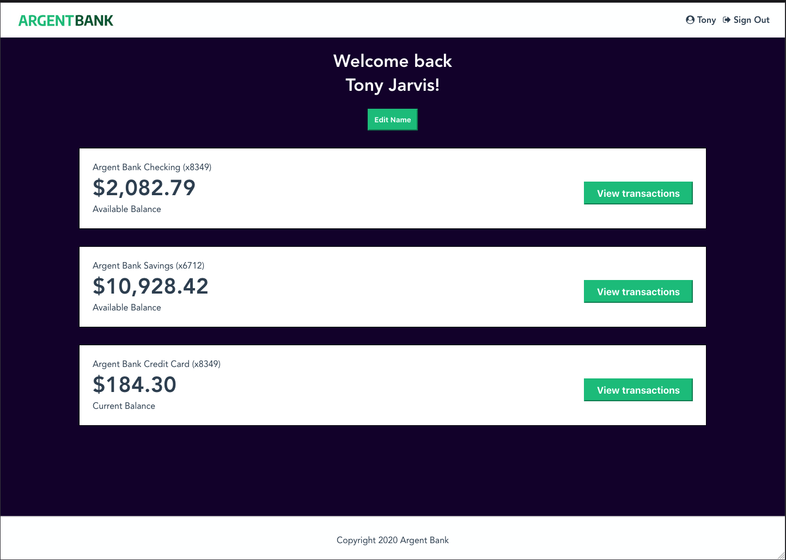

# Argent Bank
## Banking application
### [ using original API from https://github.com/OpenClassrooms-Student-Center/Project-10-Bank-API ]
---

<p align="center">
    
</p>

---

### Stack
- client
    - React/Redux
- API
    - MongoDb
    - ExpressJs
---

### Tools
- Swagger

--- 
### Project requirements & Development roadmap
- Please visit [roadmap](roadmap.md)

---
---
### INSTALL & RUN
---
#### => Prerequisites
---

- [Node.js v12](https://nodejs.org/en/)
- [MongoDB Community Server](https://www.mongodb.com/try/download/community)

Please make sure you have the right versions and download both packages. You can verify this by using the following commands in your terminal:

```bash
# Check Node.js version
node --version

# Check Mongo version
mongo --version
```
- if you don't have MongoDB installed, please refer to instructions (MacOs only) => [MONGO_INSTALL-MACOS](MONGO_INSTALL-MACOS.md)

---
### Install
---

```bash
# clone repo
git clone https://github.com/GitHubAgneska/HAgnesGenay_13_19112020.git
#install api dependencies
npm i
#install client dependencies
npm run install-client
```
---
### => Run
---
- to run the app locally, you'll need to open 2 terminal windows:
    - 1st window: run the api: 
        ```bash
            # start db
            brew services start mongodb-community

            # then
            npm run dev:server

            # Populate database with users that live in 'populateDatabase.js'
            npm run populate-db
        ``` 

    - 2d window: run React client:
        ```bash
            npm run client
        ```  
--- 

#### More info on DB 
after running `npm run populate-db`: 

your server should now be running at http://locahost:3001 and you will now have two users in your MongoDB database!

##### Populated Database Data

Once you run the `populate-db` script, you should have two users in your database:

##### Tony Stark

- First Name: `Tony`
- Last Name: `Stark`
- Email: `tony@stark.com`
- Password: `password123`

##### Steve Rogers

- First Name: `Steve`,
- Last Name: `Rogers`,
- Email: `steve@rogers.com`,
- Password: `password456`

#### API Documentation

To learn more about how the API works, once you have started your local environment, you can visit: http://localhost:3001/api-docs

---